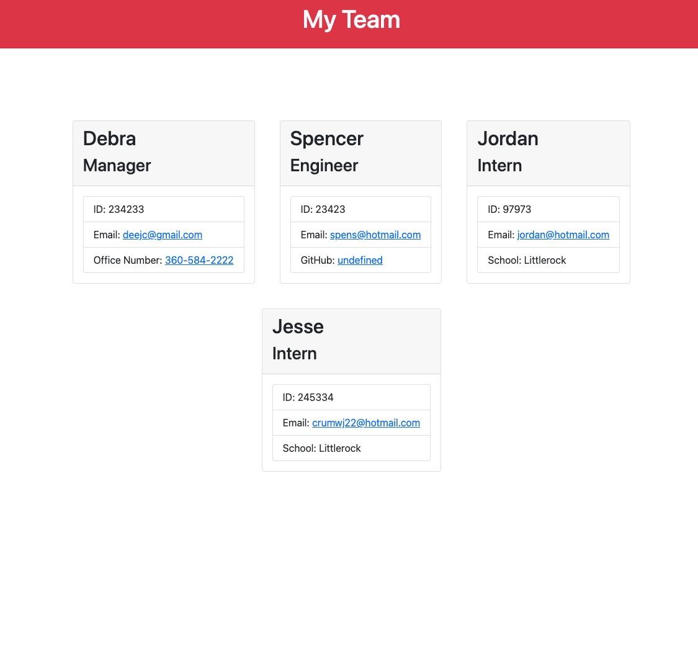

# Team Profile Generator

## Description

This is a Node.js command-line application that takes in information about employees on a software engineering team, then generates an HTML webpage that displays summaries for each person. Each part of the code has been tested to ensure that it passes.

### Table of Contents

---

- [Installation](#installation)
- [Usage](#usage)
- [License](#license)
- [Contributing](#contributing)
- [Tests](#tests)
- [Questions](#questions)

## Installation

The user should clone the repository from GitHub and download Node. This application also requires a file system and inquirer module.

## Usage

Use inquirer from your command line to answer questions about each employee that you choose to generate an HTML webpage that displays summaries for each person.

---

### License: MIT

---

## Contributing

Please read the installation section. For the repository owner, contribution guidelines are a way to communicate how people should contribute. For contributors, the guidelines help them verify that they're submitting well-formed pull requests and opening useful issues. For both owners and contributors, contribution guidelines save time and hassle caused by improperly created pull requests or issues that have to be rejected and re-submitted.

---

### Tests: npm test

---

## Questions

If you have additional questions about this project please contact me directly at <crumwj22@hotmail.com>.
You can view more of my projects at <https://github.com/crumwj22>.

<a href="https://youtu.be/uLT1EYurBYo">Link to Team Profile Generator test video</a>

